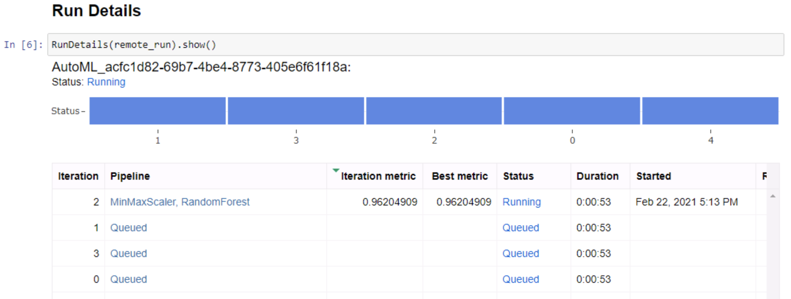

# Detecting credit card fraud via machine learning


## Table of Contents
- [Project Overview](https://github.com/lambertsbennett/AzureMLEngineer-Capstone#project-overview)
- [Dataset](https://github.com/lambertsbennett/AzureMLEngineer-Capstone#dataset)
    - [Overview](https://github.com/lambertsbennett/AzureMLEngineer-Capstone#overview)
    - [Task](https://github.com/lambertsbennett/AzureMLEngineer-Capstone#task)
    - [Access](https://github.com/lambertsbennett/AzureMLEngineer-Capstone#overview)
- [AutoML](https://github.com/lambertsbennett/AzureMLEngineer-Capstone#automated-ml)
    - [Results](https://github.com/lambertsbennett/AzureMLEngineer-Capstone#results)
- [Hyperparameter tuning](https://github.com/lambertsbennett/AzureMLEngineer-Capstone#hyperparameter-tuning)
    - [Results](https://github.com/lambertsbennett/AzureMLEngineer-Capstone#run-results)
- [Model Deployment](https://github.com/lambertsbennett/AzureMLEngineer-Capstone#model-deployment)
- [Future Work](https://github.com/lambertsbennett/AzureMLEngineer-Capstone#future-work)


## Project Overview
My capstone project for Udacity's Machine Learning Engineer Nanodegree focuses on detecting instances of credit card fraud. The objective of this project falls into the category of anomaly detection, where classification is attempted on a dataset with a highly imbalanced distribution of classes. In the case of the dataset used here instances of fraud account for only 0.172% of all instances. Anomaly detection is a fascinating area of machine learning that often requires special techniques and care in interpretation compared to other machine learning use cases. 

In order to approach this problem, I made use of both Azure's automated ML capabilities and Azure's Hyperdrive hyperparameter tuning tool. The best models from each experiment were compared to find the most performant model and the best model was then deployed as an Azure container instance for consumption. Both automated ML and Hyperdrive produced models with very good performance as assessed by Area Under the Curve (AUC), a metric that is particularly useful for model evaluation when classes are imbalanced. Both models had an AUC of >0.99 indicating good performance for the credit card fraud dataset used as training data. The kaggle dataset used for training (discussed in more detail below) consists of PCA transformed data, which unfortunately limits the applicability of my trained model, but the process was a great learning experience.

*See a video outlining model training, deployment, and interaction [here](https://www.youtube.com/watch?v=stLGRwPTz80&ab_channel=BennettLambert).*

## Dataset
### Overview
The dataset used in this project is the openly available Kaggle credit card fraud [dataset](https://www.kaggle.com/mlg-ulb/creditcardfraud). This dataset consists of the results of a PCA transformation on the original credit card transaction data. PCA was carried out to protect sensitive information present in the original data. In addition to the principle coordinates the data contains the time since the first transaction that was logged and the amount (in $) of the transaction. It is a binary classification problem where the positive label (1) corresponds to an instance of fraud and the negative label (0) is a normal transaction. The dataset is highly imbalanced with very few instances of fraud present.

### Task
The objective of this project is to classify samples as either 'normal' or 'fraudulent' transactions. In order to do this I will use all available features present in the dataset. 

### Access
In order to access the Kaggle dataset, I downloaded the compressed dataset, extracted it, and registered it as a dataset in my Azure workspace using the Azure ML Studio GUI. From this point I programmatically interacted with it through the SDK.

## Automated ML
For the automated ML run, I chose to limit the experiment to a total duration of 1 hr to reduce the potential for session timeout. The primary metric that I used as an objective for the autoML run was weighted AUC (area under the curve), which is the suggested metric for anomaly detection in the Azure documentation. AUC accounts for precision and recall of both classes and allows accurate characterisation of the performance of a model on an imbalanced dataset.

As the run progresses, details can be viewed via the RunDetails widget:


### Results
The best model from the automl process was a voting ensemble model. The model had an AUC of ~0.99 and other precision/recall metrics were all >0.97 indicating a model that performed well at the classification task. However, when I spoofed transactions the model did not accurately identify these transactions as fraud. This was surprising as the data was generated at random and had no relation to the output of PCA that was carried out on the original dataset. Examining the model explanation, two of the principle coordinates were the most important features for identifying instances of fraud. However, when I altered those features (even to extreme values) the model continued to classify transactions as normal. While these features are very important to the model, the model is incorporating information from all features in a non-trivial way making it difficult to understand the factors directly influencing decision making in the model. In the future I would run automl for a longer period in hopes that a more performant model would arise. If not, I would investigate further the factors influencing model decisions in an effort to better understand when the model is skilled at identifying fraud and instances where the model breaks down.

At the end of the run, details about the best model can be accessed programmatically.


## Hyperparameter Tuning
I chose Random Forests as the model to tune with Hyperdrive. Random Forests are versatile and perform well across a wide variety of machine learning problems. I am familiar with Random Forests from previous work and have a good understanding of the hyperparameters that impact classification strongly. For the Hyperdrive run I selected the number of estimators (trees in the forest) and the maximum depth of each tree as the hyperparameters to tune. Together these two hyperparameters can drastically improve the performance of a Random Forest model. I chose random parameter sampling over intervals that I have seen good performance for in the past (10-1000 for number of estimators and 1-100 for maximum depth). For a termination policy I chose the Bandit Policy with a slack factor of 0.2 and a delay interval of 5. This policy retains only models with similar or better performance than the current best model and stops hyperparameter turning when more performant models cease to come out of the training process.

During the tuning process, the RunDetails widget again is very useful to keep track of the progress of runs.


### Run Results
The best model obtained from Hyperdrive had an AUC of ~0.99. This model has 716 estimators, with a maximum depth of 16. This performance is comparable to that of the automl run. To improve this in the future a longer Hyperdrive run could be used. Currently the number of runs that could be carried out with Hyperdrive is limited by the VM's time limits. Another potential way to improve the model's performance in the future would be to take the top models produced by Hyperdrive and repeat the process with a narrowed parameters space (if possible).

After the Hyperdrive run, the best model can be quickly summarized programmatically.


## Model Deployment
As both model selection approaches yielded models with similar AUC (>0.99), I decided to deploy the automl model. The model was deployed as an Azure Container Instance. To query the model data is serialized to JSON and sent to the model's endpoint as an http request. For an example of code used to interact with the deployed model please see the 'Model Deployment' section of the automl notebook (automl.ipynb).

The inference configuration used for deployment simply points to the scoring script (score.py), which receives and unpacks the data submitted as JSON. The data is then converted into a Pandas dataframe, NaN values are dropped, and the model is applied to generate predictions.

The ACI configuration specifies that the model will run on a single core with 1gb of memory available to run the scoring script and underlying processes in the container. I selected these values for the demonstration as 1gb should be more than enough memory given that we are sending small test requests to the model and a single core is sufficient for these purposes as well. 

After model deployment, you can check on the status of the deployment under the endpoints tab. You should see something like the following:
.
Important here is that the deployment status is 'healthy' and there is an endpoint URL provided!

Sample data passed to the model:

```python
data = {"data":
        [ 
          {
            "Time":25,
            "V1":0.1,
            "V2":-0.1,
            "V3":0.04,
            "V4":0.013,
            "V5":-0.05,
            "V6":-0.002,
            "V7":0.2,
            "V8":-0.004,
            "V9":0.012,
            "V10":0.1,
            "V11":-0.045,
            "V12":-0.2,
            "V13":0.006,
            "V14":0.09,
            "V15":-0.087,
            "V16":-0.0065,
            "V17":0.0055,
            "V18":0.02,
            "V19":-0.01,
            "V20":-0.34,
            "V21":0.003,
            "V22":0.0082,
            "V23":-0.091,
            "V24":0.0074,
            "V25":-0.0021,
            "V26":0.004,
            "V27":-0.0077,
            "V28":-0.000002,
            "Amount":25.23
          },
          {
           "Time":2,
            "V1":0.1,
            "V2":-0.1,
            "V3":0.04,
            "V4":0.013,
            "V5":-0.05,
            "V6":-0.002,
            "V7":0.2,
            "V8":-0.004,
            "V9":0.012,
            "V10":0.1,
            "V11":-0.045,
            "V12":-0.2,
            "V13":0.006,
            "V14":0.09,
            "V15":-0.087,
            "V16":-0.0065,
            "V17":0.0055,
            "V18":0.02,
            "V19":-0.01,
            "V20":-0.34,
            "V21":0.003,
            "V22":0.0082,
            "V23":-0.091,
            "V24":0.0074,
            "V25":-0.0021,
            "V26":0.004,
            "V27":-0.0077,
            "V28":-0.000002,
            "Amount":0.23 
          },
        ]   
      }
```
Using this data it can be serialized to JSON as follows and sent as an HTTP request.

```python
input_data = json.dumps(data)

headers = {'Content-Type': 'application/json'}

resp = requests.post(scoring_uri, input_data, headers=headers)
```

Here the scoring URI is unique to the model container and can be found in the 'endpoints' section of ML studio.

As a response, the model will send back a list of predictions. In this case they will be '0' for normal transaction or '1' for fraud.


## Future Work
Although both Hyperdrive and AutoML produced models with great metric values (AUC > 0.99), there are still many avenues to strive for improvement. In the case of AutoML, the deployed model did not identify the data that I fabricated as anomalous. This could be a chance occurrence, related to the relatively high dimensionality of the input dataset, or be inherent in the difficulty of identifying anomalous data points in a dataset with diverse transactions and no means to link transactions to individual consumers. In the future, longer AutoML runs may still improve model performance by exploring more potential model configurations.

Furthermore, I would like to explore the performance of Hyperdrive using different parameter sampling policies and stopping criteria. Random parameter sampling is effective over a large number of samples, but it might be that Bayesian sampling would converge to a performant model faster. 
